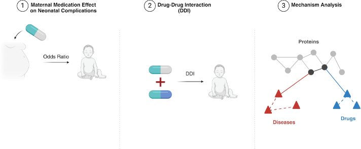

# PregMedNet
An implementation of **PregMedNet** from our publication: **Kim et al.** *"PregMedNet: Multifaceted Maternal Medication Impacts on Neonatal Complications"*

MedRxiv doi: https://doi.org/10.1101/2025.02.13.25322242


## Overview
<p align="center">
  
</p>

**PregMedNet is a platform that provides multifaceted insights into the impacts of maternal medications during pregnancy on neonatal complications.**
We systematically analyzed large-scale medical claims data with machine-learning methods to estimate multifaceted perinatal medication impacts.

It includes:s
1. Estimation of maternal medication effects on neonatal outcomes, including both raw and counfounder-adjusted
2. Analysis of drug–drug interactions during pregnancy
3. Mechanism-of-action (MoA) inference through biological network integration

🔗 Comprehensive results are available on our interactive website: http://pregmednet.stanford.edu 


## Data Availability
This project utilizes the Merative™ MarketScan® Commercial Database, a real-world healthcare dataset that contains de-identified medical records from over 188 million patients across the United States.

The dataset is available for purchase by federal, nonprofit, academic, pharmaceutical, and other qualified research organizations.
Access to the data requires a data use agreement and purchase of the relevant subset needed for the study.

For more information on licensing the Merative™ MarketScan® Commercial Database, please visit:
👉 https://www.merative.com/documents/brief/marketscan-explainer-general

In this study, the database was accessed through the Stanford Center for Population Health Sciences (PHS). 

Detailed information about data processing and cohort construction can be found in the Methods section of our paper.

*In this GitHub repository, we provide a synthetic dataset that mimics the structure of the original data used in the study.*


## System Requirements

All software dependencies and operating systems (including version numbers):
The code is implemented in Python 3.12 and has been tested on Ubuntu 22.04 LTS and macOS Sonoma.
All required dependencies are listed in the requirements.txt file and can be installed with:
```
pip install -r requirements.txt
```
Versions the software has been tested on:
Verified on Python 3.12 (compatible with Python 3.10 and above).

Any required non-standard hardware:
None. The analyses and web application run on standard CPU-based systems; no GPU or specialized hardware is required.


## Installation Guide
- Instructions: Clone the repository and install the required dependencies:
```
git clone https://github.com/yerakim824/PregMedNet.git
cd PregMedNet
pip install -r requirements.txt
```
- Typical install time on a “normal” desktop computer: Approximately 1 minute (depending on internet speed and system performance).


## Demo
- **Instructions to run on data:**  
  To reproduce the demo, clone the repository and run the synthetic example provided in `0_data/make_synthetic_dataset.ipynb`,  
  followed by the medication impact notebooks in `1_medication_impact_calculation`.  
```
  bash
  git clone https://github.com/yerakim824/PregMedNet.git
  cd PregMedNet
  pip install -r requirements.txt
  jupyter notebook 0_data/make_synthetic_dataset.ipynb
  jupyter notebook 1_medication_impact_calculation/1_new_single_meds_raw.ipynb (Takes ~ 30 seconds)
  jupyter notebook 1_medication_impact_calculation/2_new_single_meds_adjusted.ipynb
  jupyter notebook 1_medication_impact_calculation/3_drug_drug_interactions.ipynb
```
Expected outcomes can be found 0_data/results


## Code Structure
```
PregMedNet/
│
├── .devcontainer/                      # Development container configuration for reproducible environments
│
├── 0_data/
│   ├── results                         # a folder containing expected results
│   ├── make_synthetic_dataset.ipynb    # Script to generate a synthetic dataset
│   └── synthetic_baby_mom_data.csv     # Synthetic dataset used in 1_medication_impact_calculation folder
│
├── 1_medication_impact_calculation/    # Scripts for estimating medication–outcome associations
│   ├── 1_new_single_meds_raw.ipynb           # Analysis of unadjusted odds ratios
│   ├── 2_new_single_meds_adjusted.ipynb      # Analysis of adjusted odds ratios
│   └── 3_drug_drug_interactions.ipynb        # Analysis of drug-drug interactions
│
├── 2_mechanism-of-actions/             # Graph-based mechanism-of-action (MoA) inference
│   ├── MOA_functions.py                # Core functions for network integration and MoA computation
│   ├── MOA_only_with_protein_nodes.ipynb  # MoA inference using protein-level networks
│   └── MOA_with_biological_nodes.ipynb    # MoA inference integrating protein and biological nodes
│
├── Interactive_Webapp/                 # Source code for the interactive PregMedNet platform and MOA test in folder 2_mechanism-of-actions
│   ├── 2024_reference_tables/          # Reference data for node mapping (diseases, drugs, etc. kg.parquet file also used in 2_mechanism-of-actions folder)
│   ├── Dockerfile                      # Docker build for deployment
│   ├── cloudbuild.yaml                 # Google Cloud Build configuration for automated deployment
│   ├── PregMedNet_Functions.py         # Shared backend utility functions
│   ├── PregMedNet_Interactive_Website.py # Streamlit-based web interface (deployed at pregmednet.stanford.edu)
│   ├── requirements.txt                # Dependencies specific to the web app
│   └── README.md                       # Documentation for the web interface
│
├── figures/                            # Project figures for README
│   └── pregmednet_overview.png
│
├── .gitattributes                      # Git LFS configuration for large files
├── LICENSE                             # License information
├── README.md                           # Project documentation
└── requirements.txt                    # Python package dependencies for 1_medication_impact_calculation and 2_mechanism-of-actions folders
```


## License
This project is licensed under the MIT License - see the LICENSE file for details.

## Contact
Please contact Yeasul Kim (ykim824@stanford.edu) with any questions.